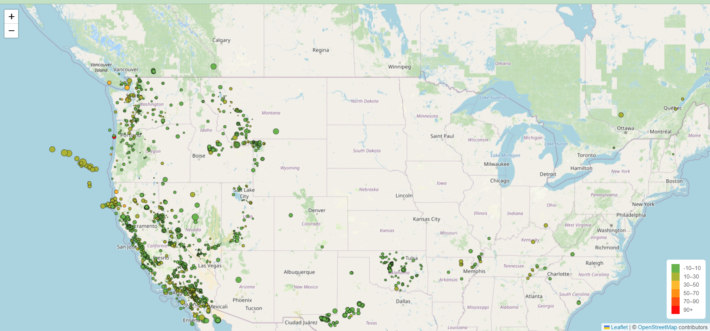

# Earthquake Visualisation using leaflet

The United States Geological Survey, or USGS for short, is responsible for providing scientific data about natural hazards, the health of our ecosystems and environment, and the impacts of climate and land-use change. Their scientists develop new methods and tools to supply timely, relevant, and useful information about the Earth and its processes.

The USGS is interested in building a new set of tools that will allow them to visualize their earthquake data. They collect a massive amount of data from all over the world each day, but they lack a meaningful way of displaying it. In this challenge, I have been tasked with developing a way to visualize USGS data that will allow them to better educate the public and other government organizations (and hopefully secure more funding) on issues facing our planet.

# For the analysis:
* I got the dataset to visualize by visiting the USGS GeoJSON Feed page. JSON representation of the dat was given, and I used the URL of this JSON to pull in the data for the visualization.
*I imported and visualized the data by doing the following:
* Used Leaflet, to create a map that plots all the earthquakes from my dataset based on their longitude and latitude.
* Used my data markers to reflect the magnitude of the earthquake by their size and the depth of the earthquake by color. Earthquakes with higher magnitudes to appear larger, and earthquakes with greater depth to appear darker in color.
* Included popups that provided additional information about the earthquake when its associated marker is clicked.
* Created  a legend that  provided context for my map data.

# The map visualization link
https://chiomauche.github.io/leaflet-earthquake-analysis/

# References
* Dataset created by the United States Geological Survey

